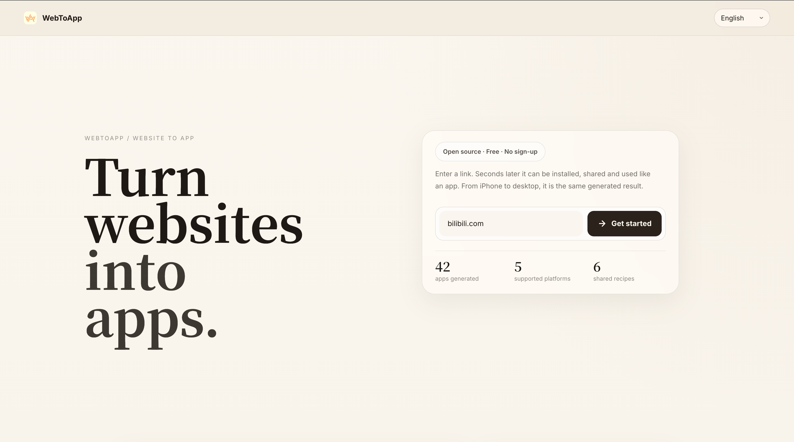
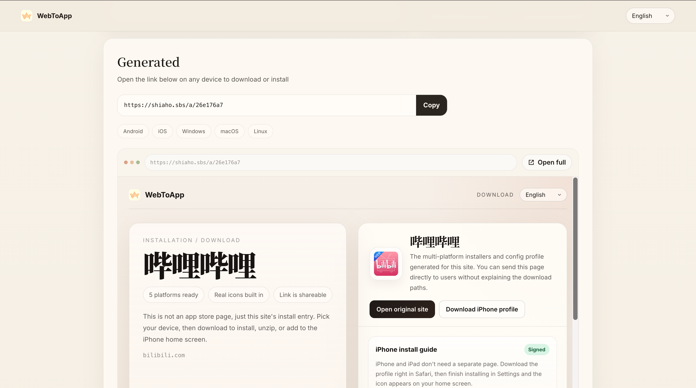
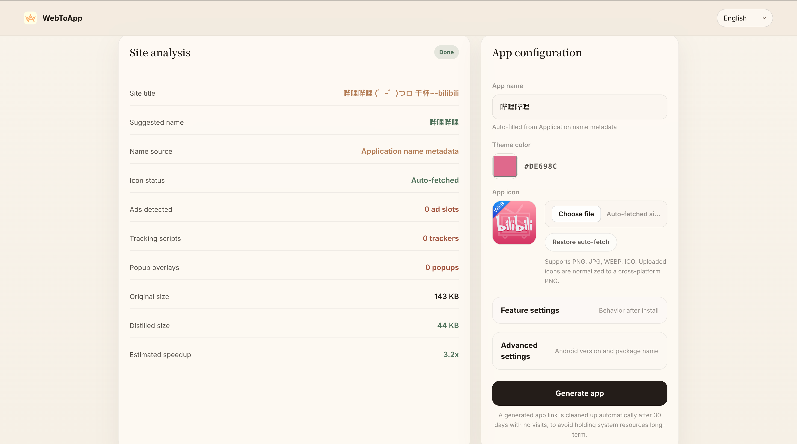

<div align="center">


# WebToApp

**Verwandle jede Website in Sekunden in eine installierbare App.**

Ein Link rein, fertige Produkte für **iPhone / iPad · Android · Windows · macOS · Linux**.

[](https://shiaho.sbs)
[](../LICENSE)
[](#features)

[English](../README.md) · [简体中文](README.zh.md) · [日本語](README.ja.md) · [العربية](README.ar.md) · [Русский](README.ru.md) · [Español](README.es.md) · [Português](README.pt.md) · [Français](README.fr.md) · **Deutsch**

</div>

---

<div align="center">
  
  
  <br>
  
  
</div>

---

Gib eine URL ein und erhalte Sekunden später ein fertiges Produkt, das du installieren, teilen und wie eine App nutzen kannst.
Ein einziges generiertes Ergebnis deckt **iPhone / iPad, Android, Windows, macOS und Linux** ab, und jedes ist nur wenige KB groß — heruntergeladen und installiert ist es daher fast augenblicklich.

Open Source · Kostenlos · Ohne Anmeldung. Live ausprobieren unter **[shiaho.sbs](https://shiaho.sbs)**.

---

## Funktionen

- **Website-Analyse**: ruft die Zielseite ab und extrahiert Name, Themenfarbe und Icon und zählt Werbung / Tracker / Popups (nur Schätzwerte zur Anzeige).
- **Plattformübergreifendes Packaging**: erstellt Installer für fünf Plattformen auf einmal
  - **Android** — ein echtes, installierbares WebView-APK (v1+v2+v3 signiert). Jede App nutzt ihr **eigenes dediziertes Signaturzertifikat**.
  - **iOS** — ein `.mobileconfig`-Web-Clip-Profil, mit optionaler CMS-Signatur über ein Zertifikat einer öffentlichen CA („signaturfreie" Installation).
  - **Windows / macOS / Linux** — leichtgewichtige Launcher mit nativem Icon.
- **Dynamischer URL-Wechsel auf iOS**: Der Web Clip zeigt auf `/a/<id>/launch`, sodass du die Ziel-URL serverseitig ohne Neuinstallation ändern kannst.
- **Verlauf**: Der Build-Verlauf wird pro Geräte-Fingerprint gespeichert, mit Export / Import auf andere Geräte.
- **Automatische Bereinigung**: Apps ohne Besuche über 30 Tage werden automatisch zurückgewonnen.
- **Optionales Cloudflare-R2-Offload**: Downloads laufen über das CDN und sparen Origin-Bandbreite.
- **Mehrsprachige Oberfläche**: 9 integrierte Sprachen (Englisch, vereinfachtes Chinesisch, Japanisch, Arabisch, Russisch, Spanisch, Portugiesisch, Französisch, Deutsch), folgt automatisch der Browsersprache, mit RTL-Layout für Arabisch. Manuelle Umschaltung oben rechts.

## App-Größe

Jedes Paket ist nur ein dünner Einstiegspunkt zu deiner Website — es bündelt keine Website-Inhalte, daher werden die Artefakte in **Kilobyte, nicht Megabyte** gemessen. Darunter nutzt es die native, leichtgewichtige Hülle jeder Plattform: ein Android-WebView-APK, ein iOS-Web-Clip-Profil und `.app` / `.bat` / `.desktop`-Launcher, die den Systembrowser im App-Modus öffnen.

An einem echten Build gemessen (die Werte sind repräsentativ und variieren kaum je nach Site):

| Plattform | Paket | Typische Größe | Inhalt |
| --- | --- | --- | --- |
| Android | `android.apk` | **~21 KB** | Ein echtes, installierbares WebView-APK (v1+v2+v3 signiert) |
| iOS / iPadOS | `ios.mobileconfig` | **~4 KB** | Ein Web-Clip-Konfigurationsprofil |
| macOS | `macos.zip` | **~1,4 KB** | Ein `.app`-Bundle (Launcher-Skript + Icon) |
| Windows | `windows.zip` | **~1,2 KB** | Ein `.bat`-Launcher + Verknüpfungshelfer + Icon |
| Linux | `linux.tar.gz` | **~0,7 KB** | Ein `.desktop`-Eintrag + Installationsskript + Icon |

## Technologie-Stack

- Backend: Python + FastAPI + Uvicorn
- Frontend: reines HTML / CSS / JS (statische Dateien, direkt vom Backend ausgeliefert)
- Packaging-Toolchain: Android SDK (aapt2 / d8 / apksigner / zipalign), apktool, Pillow, openssl

## Projektstruktur

```
.
├── index.html              Startseite
├── css/ js/ assets/        Statische Frontend-Ressourcen
│   └── js/i18n.js          Leichtgewichtige i18n-Runtime
│       js/i18n.strings.js  Übersetzungen für 9 Sprachen
├── server/
│   ├── main.py             FastAPI-App und Routen
│   ├── config.py           Konfiguration über Umgebungsvariablen
│   ├── history_store.py    Geräte-Verlaufsspeicher (JSON)
│   └── engine/
│       ├── analyzer.py     Website-Analyse
│       ├── distiller.py    Erzeugt die Pakete je Plattform (Kern)
│       ├── apk_builder.py  Android-APK-Build und -Signatur
│       ├── mobileconfig_signer.py  iOS-Profil-Signatur
│       ├── storage.py      Cloudflare-R2-Offload
│       └── recipe.py       Beispiel-Rezeptdaten
├── certs/                  Signaturmaterial (private Schlüssel werden nicht eingecheckt)
└── generated/              Zur Laufzeit erzeugte Apps und Daten (nicht eingecheckt)
```

## Schnellstart

Erfordert Python 3.10+. Das Bauen eines Android-APK erfordert das Android SDK und `apktool` (fällt bei Fehlen automatisch auf ein PWA-Offline-Paket zurück).

```bash
# 1. Virtuelle Umgebung erstellen und Abhängigkeiten installieren
python3 -m venv venv
source venv/bin/activate
pip install -r server/requirements.txt

# 2. Konfiguration (optional, alles hat Standardwerte)
cp .env.example .env
# .env nach Bedarf bearbeiten

# 3. Starten
uvicorn server.main:app --host 127.0.0.1 --port 8000
```

Öffne http://127.0.0.1:8000.

> Für die lokale Entwicklung sind keine Umgebungsvariablen nötig. Beim öffentlichen Deployment setze `PUBLIC_BASE_URL`,
> sonst können iPhones `localhost` nicht öffnen. Die vollständige Liste siehe [`.env.example`](../.env.example).

## Deployment

> Eine vollständige Produktiv-Bereitstellungsanleitung (systemd, Nginx, HTTPS, Android/iOS, R2) findest du in **[DEPLOY.de.md](DEPLOY.de.md)**.

In der Produktion wird es üblicherweise unter systemd hinter einem Nginx-Reverse-Proxy ausgeführt:

```ini
# /etc/systemd/system/webtoapp.service
[Unit]
Description=WebToApp
After=network.target

[Service]
WorkingDirectory=/path/to/web-to-app
Environment=PUBLIC_BASE_URL=https://your-domain.com
ExecStart=/path/to/web-to-app/venv/bin/uvicorn server.main:app --host 127.0.0.1 --port 8000
Restart=always

[Install]
WantedBy=multi-user.target
```

Zur Zertifikatskonfiguration für die iOS-Profil-Signatur („signaturfreie" Installation) siehe [`certs/README.md`](../certs/README.md).

## Sicherheitshinweise

- Alle Geheimnisse (R2, Cloudflare, Signaturpasswörter) werden aus Umgebungsvariablen gelesen; das Repository enthält keine echten Zugangsdaten.
- **Private Signaturschlüssel (`certs/*.keystore`, `certs/app-keys/`) und Laufzeitdaten (`generated/`) werden standardmäßig per `.gitignore` ausgeschlossen — niemals einchecken.**
- Jede generierte Android-App verwendet ihr eigenes unabhängiges Signaturzertifikat, was eine massenhafte Kennzeichnung anhand des Zertifikat-Fingerprints verhindert und sicherstellt, dass dieselbe App direkt aktualisiert werden kann.

## Lizenz

[MIT](../LICENSE)
